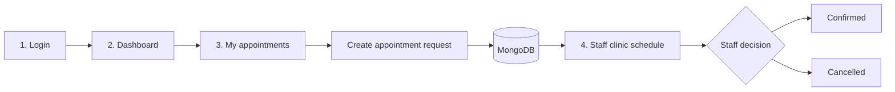

# MediTrack | Clinic Appointment Portal

> A focused digital front desk for turning appointment requests into clear, trackable clinic decisions.

MediTrack connects two everyday workflows in one small, secure portal: patients request care and follow progress, while staff review the shared schedule and act on each request.

| Patient workspace | Staff workspace |
| --- | --- |
| Create, review, and cancel appointment requests | Review the full clinic queue and update request status |

**Built with:** React + Redux Toolkit · Express · MongoDB · JWT cookies


## At A Glance

| | Capability | What it does |
| --- | --- | --- |
| **01** | Secure access | Cookie-based authentication, protected routes, and role-based staff access |
| **02** | Appointment requests | Patients submit a doctor, reason, and preferred date and time |
| **03** | Shared visibility | Staff see every request while patients see only their own appointments |
| **04** | Clear decisions | Staff confirm or cancel requests; status is reflected in the patient view |
| **05** | Recovery built in | Password reset tokens are hashed and expire after 15 minutes |

## How The Workflow Moves



| Stage | Screen | Responsibility |
| --- | --- | --- |
| **1** | **Login** | Authenticate the patient or staff member and restore the session on reload |
| **2** | **Dashboard** | Enter a doctor, reason, and preferred appointment time |
| **3** | **My appointments** | Track personal requests, statuses, and cancellations |
| **4** | **Staff clinic schedule** | Review the full queue and confirm or cancel requests |

Every new request begins as `requested`, travels through the API into MongoDB, and returns to the appropriate workspace as its status changes.

## What Is Included

### Patient experience

- Cookie-based sign in and session restoration
- Appointment request form with date and time
- Personal appointment history
- Cancellation of owned requests
- Forgot-password and reset-password flows

### Clinic operations

- Staff-only clinic schedule
- Patient details alongside each request
- Confirm and cancel actions with visible statuses
- Server-side role enforcement in addition to route guards

### Security foundation

- HttpOnly JWT cookies
- Centralized unauthorized-response handling
- Helmet security headers
- MongoDB query sanitization
- Rate limiting for authentication endpoints
- Credentialed CORS configuration

## Technology Stack

| Layer | Technology |
| --- | --- |
| Frontend | React, Vite, React Router, Redux Toolkit, Axios |
| Backend | Node.js, Express |
| Database | MongoDB with Mongoose |
| Authentication | JWT in an HttpOnly cookie, bcryptjs |
| Security | Helmet, express-rate-limit, express-mongo-sanitize |

## Project Structure

```text
Medi_Track/
├── client/
│   └── src/
│       ├── api/axios.js                 # Axios client and 401 handling
│       ├── app/store.js                 # Redux store
│       ├── components/Navbar.jsx        # Navigation and role links
│       ├── features/
│       │   ├── appointments/
│       │   │   ├── Dashboard.jsx         # Patient dashboard
│       │   │   ├── AppointmentsOnly.jsx  # Patient appointment list
│       │   │   ├── StaffPanel.jsx        # Staff clinic schedule
│       │   │   └── appointmentsSlice.js  # Appointment state and API calls
│       │   └── auth/                     # Login, registration, reset flows
│       └── routes/                       # Protected and role-based routes
├── server/
│   ├── middleware/                       # Auth, role, and security middleware
│   ├── models/                           # User and Appointment schemas
│   ├── routes/                           # Auth, patient, and staff APIs
│   └── server.js                         # Express entrypoint
└── README.md
```

## Getting Started

### Prerequisites

- Node.js 18 or newer
- MongoDB running locally, or a MongoDB Atlas connection string

### 1. Configure the server

```bash
cd server
npm install
```

Create `server/.env`:

```env
PORT=5000
MONGO_URI=mongodb://127.0.0.1:27017/meditrack
JWT_SECRET=replace-with-a-long-random-secret
CLIENT_URL=http://localhost:5173
NODE_ENV=development
```

Start the API:

```bash
npm run dev
```

The API runs at `http://localhost:5000`.

### 2. Start the frontend

Open a second terminal:

```bash
cd client
npm install
npm run dev
```

Open `http://localhost:5173` in the browser.

> Keep the host consistent. Use `localhost` for both the frontend and API configuration; switching between `localhost` and `127.0.0.1` creates separate browser cookie scopes.

## Creating a Staff Account

Registration creates patient accounts by default. To test the staff workflow, update an existing user in MongoDB:

```js
db.users.updateOne(
  { email: "staff@example.com" },
  { $set: { role: "staff" } }
)
```

Sign out and sign in again after changing the role so the new JWT contains `role: "staff"`. The Clinic schedule link will then appear in the navbar.

## API Overview

### Authentication

| Method | Endpoint | Purpose |
| --- | --- | --- |
| `POST` | `/api/auth/register` | Create a patient account |
| `POST` | `/api/auth/login` | Sign in and set the auth cookie |
| `GET` | `/api/auth/me` | Restore the current session |
| `POST` | `/api/auth/logout` | Clear the auth cookie |
| `POST` | `/api/auth/forgot-password` | Create a 15-minute reset token |
| `POST` | `/api/auth/reset-password/:raw` | Set a new password |

### Appointments

| Method | Endpoint | Access |
| --- | --- | --- |
| `GET` | `/api/appointments` | Authenticated patient |
| `POST` | `/api/appointments` | Authenticated patient |
| `DELETE` | `/api/appointments/:id` | Appointment owner |
| `GET` | `/api/staff/appointments` | Staff only |
| `PATCH` | `/api/staff/appointments/:id/status` | Staff only |

Health check:

```text
GET http://localhost:5000/api/health
```

## Session and Security Notes

- Authentication cookies are HttpOnly and are sent by Axios with `withCredentials: true`.
- The frontend calls `/api/auth/me` after a full page reload to restore the Redux auth state.
- Do not store `JWT_SECRET` or database credentials in source control.
- Password reset records store only a SHA-256 token hash and an expiration date.
- Authentication routes are rate-limited, and request data is sanitized against NoSQL injection.

## Validation

Build the frontend:

```bash
cd client
npm run build
```

Check the server entrypoint:

```bash
node --check server/server.js
```

## Troubleshooting

| Symptom | Check |
| --- | --- |
| Login returns `Invalid credentials` | Confirm the email, password, and MongoDB user record |
| Login disappears after reload | Confirm the API is running and use the same `localhost` host consistently |
| Patient request does not save | Confirm MongoDB is running and `MONGO_URI` is reachable |
| Clinic schedule link is missing | Confirm the account has `role: "staff"`, then sign in again |
| Clinic schedule is empty | Confirm the patient request was saved and the staff account can access `/api/staff/appointments` |

## License

No license has been specified for this project.

## Product Tour

The screenshots follow the same path a user takes through the portal.

| 1 · Login | 2 · Dashboard |
| --- | --- |
| [](ScreenShots/Login_Page.png) | [](ScreenShots/Dashboard.png) |
| Secure entry for patients and staff | Create a new appointment request |

| 3 · My Appointments | 4 · Staff Clinic Schedule |
| --- | --- |
| [](ScreenShots/My_Appointments.png) | [](ScreenShots/Staff_Approving.png) |
| Track personal requests and statuses | Review, confirm, or cancel clinic requests |

> The images in `ScreenShots/` are visual references from the running application. Keep the folder available when previewing this README locally.
