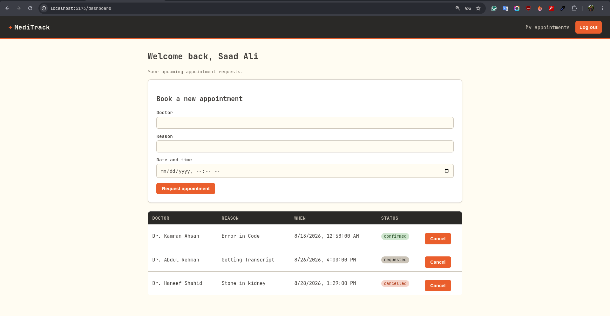
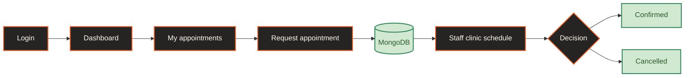
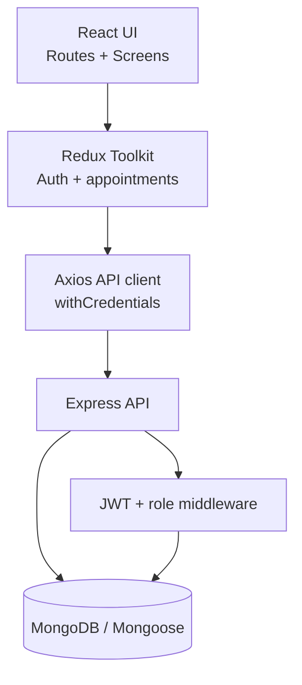
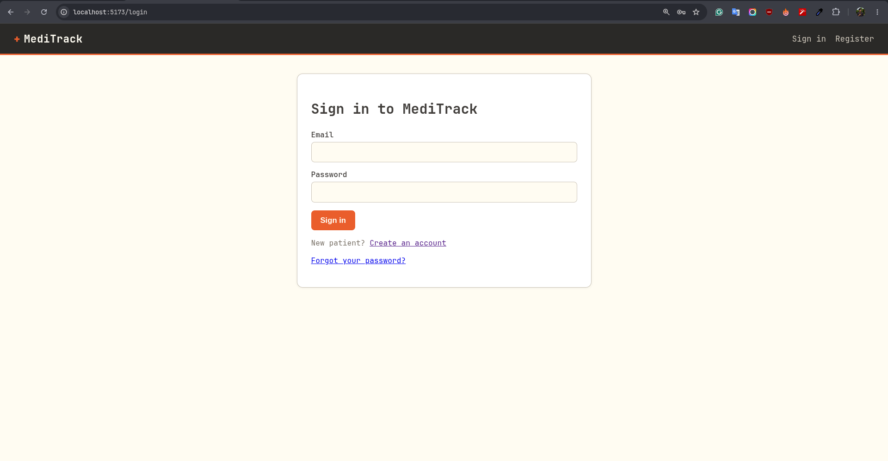
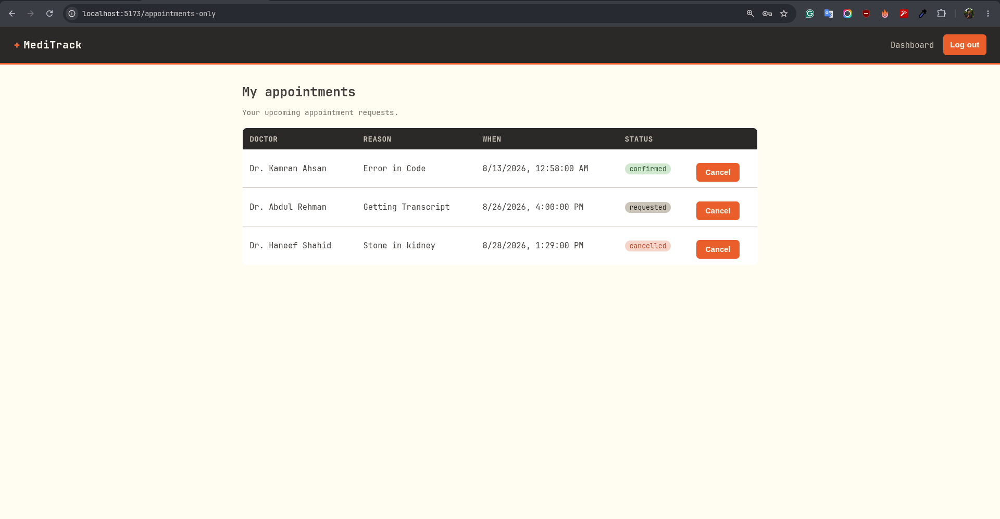
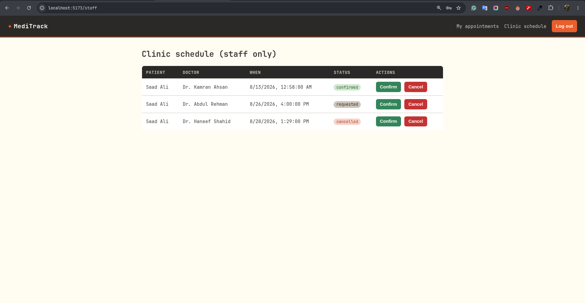

**Built with:**

[](https://react.dev/)
[](https://vite.dev/)
[](https://reactrouter.com/)
[](https://redux-toolkit.js.org/)
[](https://axios-http.com/)
[](https://nodejs.org/)
[](https://expressjs.com/)
[](https://www.mongodb.com/)
[](https://mongoosejs.com/)
[](https://jwt.io/)
[](https://www.npmjs.com/package/bcryptjs)
[](https://helmetjs.github.io/)
[](https://www.npmjs.com/package/express-rate-limit)
[](https://www.npmjs.com/package/express-mongo-sanitize)

# MediTrack

## Clinic Appointment Portal

> A focused digital front desk for turning appointment requests into clear, trackable clinic decisions.

MediTrack connects two everyday workflows in one small, secure portal: patients request care and follow progress, while staff review the shared schedule and act on each request.

| Patient workspace | Staff workspace |
| --- | --- |
| Create, review, and cancel appointment requests | Review the full clinic queue and update request status |

<p align="center">
  <strong>Patients request care. Staff make decisions. Everyone sees what happens next.</strong>
</p>

<p align="center">
  <a href="#getting-started">Quick start</a> ·
  <a href="#product-tour">Screenshots</a> ·
  <a href="#api-overview">API</a> ·
  <a href="#troubleshooting">Troubleshooting</a>
</p>

<p align="center">
  
</p>

<p align="center"><em>The patient dashboard is the starting point for a request that becomes a staff decision.</em></p>

## The Product In One Minute

| | Capability | What it does |
| --- | --- | --- |
| **01** | Secure access | Cookie-based authentication, protected routes, and role-based staff access |
| **02** | Appointment requests | Patients submit a doctor, reason, and preferred date and time |
| **03** | Shared visibility | Staff see every request while patients see only their own appointments |
| **04** | Clear decisions | Staff confirm or cancel requests; status is reflected in the patient view |
| **05** | Recovery built in | Password reset tokens are hashed and expire after 15 minutes |

### Two roles, one shared truth

| Patient | Staff |
| --- | --- |
| Requests an appointment with the doctor, reason, and preferred time. | Sees the clinic-wide queue with patient details and scheduled times. |
| Tracks whether the request is `requested`, `confirmed`, or `cancelled`. | Moves a request forward with a clear Confirm or Cancel action. |
| Controls only their own appointments. | Gets access only when the server verifies the `staff` role. |

## The Request Lifecycle



| Stage | Screen | Responsibility |
| --- | --- | --- |
| **1** | **Login** | Authenticate the patient or staff member and restore the session on reload |
| **2** | **Dashboard** | Enter a doctor, reason, and preferred appointment time |
| **3** | **My appointments** | Track personal requests, statuses, and cancellations |
| **4** | **Staff clinic schedule** | Review the full queue and confirm or cancel requests |

Every request begins as `requested`, travels through the API into MongoDB, and returns to the appropriate workspace as its status changes. The patient and staff screens are two views of the same appointment record, not disconnected workflows.

## What Is Included

### Patient experience

- Cookie-based sign in and session restoration
- Appointment request form with date and time
- Personal appointment history
- Cancellation of owned requests
- Forgot-password and reset-password flows

### Clinic operations

- Staff-only clinic schedule
- Patient details alongside each request
- Confirm and cancel actions with visible statuses
- Server-side role enforcement in addition to route guards

### Security foundation

- HttpOnly JWT cookies
- Centralized unauthorized-response handling
- Helmet security headers
- MongoDB query sanitization
- Rate limiting for authentication endpoints
- Credentialed CORS configuration

## Architecture At A Glance



The frontend owns presentation and request state. The API owns authentication, authorization, validation boundaries, and persistence. The database remains the source of truth, so a reload or a second browser tab can restore the current session and appointment data.

## Engineering Notes

- **Session continuity:** the JWT lives in an HttpOnly cookie; the app restores user state through `/api/auth/me` instead of trusting browser storage.
- **Least privilege:** patients can access only their own appointments, while staff access is checked again on the server.
- **One decision path:** appointment status changes use the same API record that appears in both patient and staff views.
- **Failure visibility:** API errors are surfaced in the relevant screen instead of leaving an empty table with no explanation.

## Technology Stack

| Layer | Technology |
| --- | --- |
| Frontend | React, Vite, React Router, Redux Toolkit, Axios |
| Backend | Node.js, Express |
| Database | MongoDB with Mongoose |
| Authentication | JWT in an HttpOnly cookie, bcryptjs |
| Security | Helmet, express-rate-limit, express-mongo-sanitize |

## Project Structure

```text
Medi_Track/
├── client/
│   └── src/
│       ├── api/axios.js                 # Axios client and 401 handling
│       ├── app/store.js                 # Redux store
│       ├── components/Navbar.jsx        # Navigation and role links
│       ├── features/
│       │   ├── appointments/
│       │   │   ├── Dashboard.jsx         # Patient dashboard
│       │   │   ├── AppointmentsOnly.jsx  # Patient appointment list
│       │   │   ├── StaffPanel.jsx        # Staff clinic schedule
│       │   │   └── appointmentsSlice.js  # Appointment state and API calls
│       │   └── auth/                     # Login, registration, reset flows
│       └── routes/                       # Protected and role-based routes
├── server/
│   ├── middleware/                       # Auth, role, and security middleware
│   ├── models/                           # User and Appointment schemas
│   ├── routes/                           # Auth, patient, and staff APIs
│   └── server.js                         # Express entrypoint
└── README.md
```

## Getting Started

### Prerequisites

- Node.js 18 or newer
- MongoDB running locally, or a MongoDB Atlas connection string

### 1. Configure the server

```bash
cd server
npm install
```

Create `server/.env`:

```env
PORT=5000
MONGO_URI=mongodb://127.0.0.1:27017/meditrack
JWT_SECRET=replace-with-a-long-random-secret
CLIENT_URL=http://localhost:5173
NODE_ENV=development
```

Start the API:

```bash
npm run dev
```

The API runs at `http://localhost:5000`.

### 2. Start the frontend

Open a second terminal:

```bash
cd client
npm install
npm run dev
```

Open `http://localhost:5173` in the browser.

> Keep the host consistent. Use `localhost` for both the frontend and API configuration; switching between `localhost` and `127.0.0.1` creates separate browser cookie scopes.

## Creating a Staff Account

Registration creates patient accounts by default. To test the staff workflow, update an existing user in MongoDB:

```js
db.users.updateOne(
  { email: "staff@example.com" },
  { $set: { role: "staff" } }
)
```

Sign out and sign in again after changing the role so the new JWT contains `role: "staff"`. The Clinic schedule link will then appear in the navbar.

## API Overview

### Authentication

| Method | Endpoint | Purpose |
| --- | --- | --- |
| `POST` | `/api/auth/register` | Create a patient account |
| `POST` | `/api/auth/login` | Sign in and set the auth cookie |
| `GET` | `/api/auth/me` | Restore the current session |
| `POST` | `/api/auth/logout` | Clear the auth cookie |
| `POST` | `/api/auth/forgot-password` | Create a 15-minute reset token |
| `POST` | `/api/auth/reset-password/:raw` | Set a new password |

### Appointments

| Method | Endpoint | Access |
| --- | --- | --- |
| `GET` | `/api/appointments` | Authenticated patient |
| `POST` | `/api/appointments` | Authenticated patient |
| `DELETE` | `/api/appointments/:id` | Appointment owner |
| `GET` | `/api/staff/appointments` | Staff only |
| `PATCH` | `/api/staff/appointments/:id/status` | Staff only |

Health check:

```text
GET http://localhost:5000/api/health
```

## Session and Security Notes

- Authentication cookies are HttpOnly and are sent by Axios with `withCredentials: true`.
- The frontend calls `/api/auth/me` after a full page reload to restore the Redux auth state.
- Do not store `JWT_SECRET` or database credentials in source control.
- Password reset records store only a SHA-256 token hash and an expiration date.
- Authentication routes are rate-limited, and request data is sanitized against NoSQL injection.

## Validation

Build the frontend:

```bash
cd client
npm run build
```

Check the server entrypoint:

```bash
node --check server/server.js
```

## Troubleshooting

| Symptom | Check |
| --- | --- |
| Login returns `Invalid credentials` | Confirm the email, password, and MongoDB user record |
| Login disappears after reload | Confirm the API is running and use the same `localhost` host consistently |
| Patient request does not save | Confirm MongoDB is running and `MONGO_URI` is reachable |
| Clinic schedule link is missing | Confirm the account has `role: "staff"`, then sign in again |
| Clinic schedule is empty | Confirm the patient request was saved and the staff account can access `/api/staff/appointments` |

## License

No license has been specified for this project.

## Product Tour

The screenshots follow the same path a user takes through the portal.

### 1 · Login

<p align="center">
  
</p>

<p align="center"><em>Secure entry for patients and staff</em></p>

### 2 · Dashboard

<p align="center">
  
</p>

<p align="center"><em>Create a new appointment request</em></p>

### 3 · My Appointments

<p align="center">
  
</p>

<p align="center"><em>Track personal requests and statuses</em></p>

### 4 · Staff Clinic Schedule

<p align="center">
  
</p>

<p align="center"><em>Review, confirm, or cancel clinic requests</em></p>

> The images in `ScreenShots/` are visual references from the running application. Keep the folder available when previewing this README locally.
