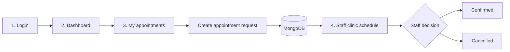

# MediTrack

## Clinic Appointment Portal

MediTrack is a full-stack clinic appointment portal for patients and clinic staff. Patients can create and manage appointment requests, while staff can review the clinic-wide schedule and approve or cancel requests.


## Patient and Staff Journey



### 1. Login

Users sign in with their email and password. The server issues a JWT in an HttpOnly cookie, and the frontend restores the session with `GET /api/auth/me` when the app opens or reloads.

### 2. Dashboard

The dashboard is the patient workspace. It shows the signed-in user and provides the form for requesting an appointment with:

- Doctor
- Reason for visit
- Date and time

New requests start with the `requested` status.

### 3. My appointments

The My appointments view displays the patient's own requests, including the doctor, reason, scheduled time, and current status. Patients can cancel their requests from this screen.

### 4. Staff clinic schedule

Staff users can open Clinic schedule from the navigation bar. This view lists every appointment request with the patient name and provides separate actions to:

- Confirm a request
- Cancel a request

The staff role is enforced by the API as well as the frontend route guard.

## Features

- Cookie-based JWT authentication
- Protected patient and staff routes
- Patient appointment creation, listing, and cancellation
- Staff-wide appointment review and status management
- Password reset flow with hashed, expiring tokens
- Centralized handling of unauthorized API responses
- Helmet security headers
- MongoDB query sanitization
- Rate limiting for authentication endpoints
- CORS configured for credentialed requests

## Technology Stack

| Layer | Technology |
| --- | --- |
| Frontend | React, Vite, React Router, Redux Toolkit, Axios |
| Backend | Node.js, Express |
| Database | MongoDB with Mongoose |
| Authentication | JWT in an HttpOnly cookie, bcryptjs |
| Security | Helmet, express-rate-limit, express-mongo-sanitize |

## Project Structure

```text
Medi_Track/
├── client/
│   └── src/
│       ├── api/axios.js                 # Axios client and 401 handling
│       ├── app/store.js                 # Redux store
│       ├── components/Navbar.jsx        # Navigation and role links
│       ├── features/
│       │   ├── appointments/
│       │   │   ├── Dashboard.jsx         # Patient dashboard
│       │   │   ├── AppointmentsOnly.jsx  # Patient appointment list
│       │   │   ├── StaffPanel.jsx        # Staff clinic schedule
│       │   │   └── appointmentsSlice.js  # Appointment state and API calls
│       │   └── auth/                     # Login, registration, reset flows
│       └── routes/                       # Protected and role-based routes
├── server/
│   ├── middleware/                       # Auth, role, and security middleware
│   ├── models/                           # User and Appointment schemas
│   ├── routes/                           # Auth, patient, and staff APIs
│   └── server.js                         # Express entrypoint
└── README.md
```

## Getting Started

### Prerequisites

- Node.js 18 or newer
- MongoDB running locally, or a MongoDB Atlas connection string

### 1. Configure the server

```bash
cd server
npm install
```

Create `server/.env`:

```env
PORT=5000
MONGO_URI=mongodb://127.0.0.1:27017/meditrack
JWT_SECRET=replace-with-a-long-random-secret
CLIENT_URL=http://localhost:5173
NODE_ENV=development
```

Start the API:

```bash
npm run dev
```

The API runs at `http://localhost:5000`.

### 2. Start the frontend

Open a second terminal:

```bash
cd client
npm install
npm run dev
```

Open `http://localhost:5173` in the browser.

> Keep the host consistent. Use `localhost` for both the frontend and API configuration; switching between `localhost` and `127.0.0.1` creates separate browser cookie scopes.

## Creating a Staff Account

Registration creates patient accounts by default. To test the staff workflow, update an existing user in MongoDB:

```js
db.users.updateOne(
  { email: "staff@example.com" },
  { $set: { role: "staff" } }
)
```

Sign out and sign in again after changing the role so the new JWT contains `role: "staff"`. The Clinic schedule link will then appear in the navbar.

## API Overview

### Authentication

| Method | Endpoint | Purpose |
| --- | --- | --- |
| `POST` | `/api/auth/register` | Create a patient account |
| `POST` | `/api/auth/login` | Sign in and set the auth cookie |
| `GET` | `/api/auth/me` | Restore the current session |
| `POST` | `/api/auth/logout` | Clear the auth cookie |
| `POST` | `/api/auth/forgot-password` | Create a 15-minute reset token |
| `POST` | `/api/auth/reset-password/:raw` | Set a new password |

### Appointments

| Method | Endpoint | Access |
| --- | --- | --- |
| `GET` | `/api/appointments` | Authenticated patient |
| `POST` | `/api/appointments` | Authenticated patient |
| `DELETE` | `/api/appointments/:id` | Appointment owner |
| `GET` | `/api/staff/appointments` | Staff only |
| `PATCH` | `/api/staff/appointments/:id/status` | Staff only |

Health check:

```text
GET http://localhost:5000/api/health
```

## Session and Security Notes

- Authentication cookies are HttpOnly and are sent by Axios with `withCredentials: true`.
- The frontend calls `/api/auth/me` after a full page reload to restore the Redux auth state.
- Do not store `JWT_SECRET` or database credentials in source control.
- Password reset records store only a SHA-256 token hash and an expiration date.
- Authentication routes are rate-limited, and request data is sanitized against NoSQL injection.

## Validation

Build the frontend:

```bash
cd client
npm run build
```

Check the server entrypoint:

```bash
node --check server/server.js
```

## Troubleshooting

| Symptom | Check |
| --- | --- |
| Login returns `Invalid credentials` | Confirm the email, password, and MongoDB user record |
| Login disappears after reload | Confirm the API is running and use the same `localhost` host consistently |
| Patient request does not save | Confirm MongoDB is running and `MONGO_URI` is reachable |
| Clinic schedule link is missing | Confirm the account has `role: "staff"`, then sign in again |
| Clinic schedule is empty | Confirm the patient request was saved and the staff account can access `/api/staff/appointments` |

## License

No license has been specified for this project.
